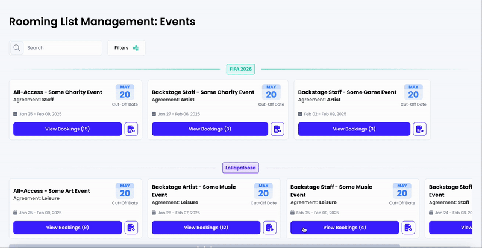
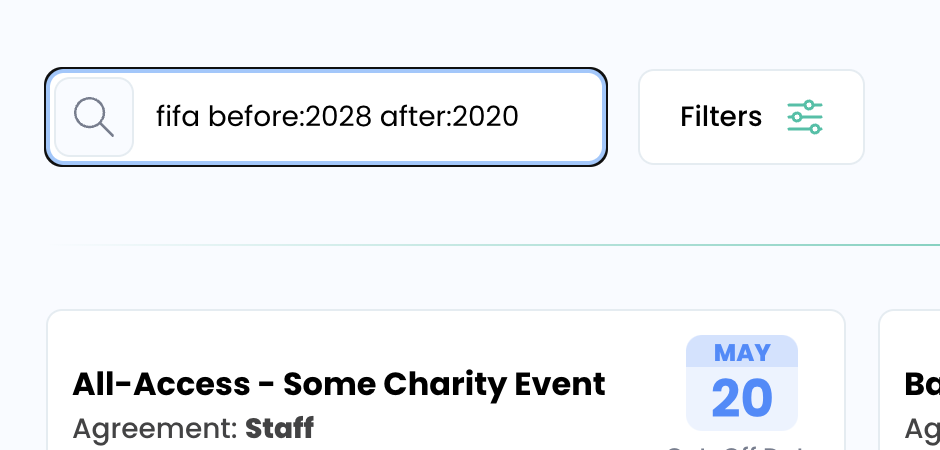

<a name="readme-top"></a>
<br />
<div align="center">
  <h1 align="center">Rooming List Management App</h1>
</div>

https://rooming-list-management.vercel.app/

<!-- ABOUT THE PROJECT -->

## About The Project




### Built With

The tech stack used for this application is Typescript as the language, NextJS, Drizzle ORM and PostgreSQL.

### Search


The search bar bring results upon matching event name, RFP Name (event_internal_name), cut-off dates, and agreement type (staff, leisure, etc).

To search by cut-off date you can use the keywords `after:` and `before:`, following by a valid date in a `YYYY-MM-DD`, `YYYY-MM` or `YYYY` format

<!-- GETTING STARTED -->

## Local development


### Prerequisites

To run the project you need the following:

- `node` version greater or equal to `v18.00`
- Docker


### Installation

1. Clone the repo

2. Go to the root of the project and install NPM packages
   ```sh
   npm install
   ```
3. Create a `.env` and add set your postgresql connection string as the DATABASE_URL environment (you can just rename `.env.example` to `.env`) 
3. Run the following command to start a postgresql instance with docker compose (make sure docker is running)
   ```sh
   npm run docker:up
   ```
4. Once is running you'll need to run the migrations
   ```sh
   npm run db:migrate
   ```
5. As a next step you need to seed the database
   ```sh
   npm run db:seed
   ```
6. Finally you can run the NextJS project
   ```sh
   npm run dev
   ```
