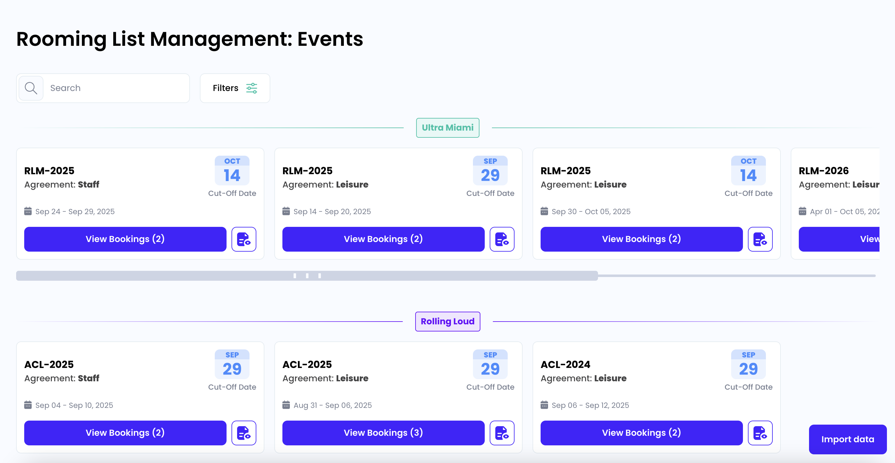

<a name="readme-top"></a>
<br />
<div align="center">
  <h1 align="center">Rooming List Management App</h1>
</div>

WEB: https://rooming-list-management.vercel.app/

API: https://rooming-list-management.onrender.com/


<!-- ABOUT THE PROJECT -->

## About The Project




### Built With

- NextJS
- Turbopack
- NestJS
- Drizzle ORM
- PostgreSQL

<!-- GETTING STARTED -->

## Local development


### Prerequisites

To run the project you need the following:

- `node` version greater or equal to `v20.11.1`
- Docker


### Installation

1. Clone the repo

2. From the root of the repo run the following command to install NPM packages
   ```sh
   npm install
   ```
3. The `web` and `api` are located inside the `apps` directory, as a next step rename both `.env.example` located in `apps/web` and `apps/api` to `.env`:
    ```sh
   cp apps/web/.env.example apps/web/.env
   cp apps/api/.env.example apps/api/.env
   ```
3. Run the following command to start a postgresql instance with docker compose (make sure docker is running)
   ```sh
   npm run docker:up
   ```
4. Once is running you'll need to run the migrations
   ```sh
   npm run db:migrate
   ```
6. Finally you can run both apps with the following command
   ```sh
   npm run dev
   ```
